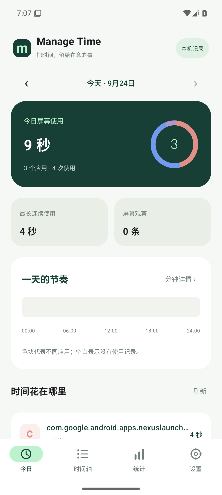
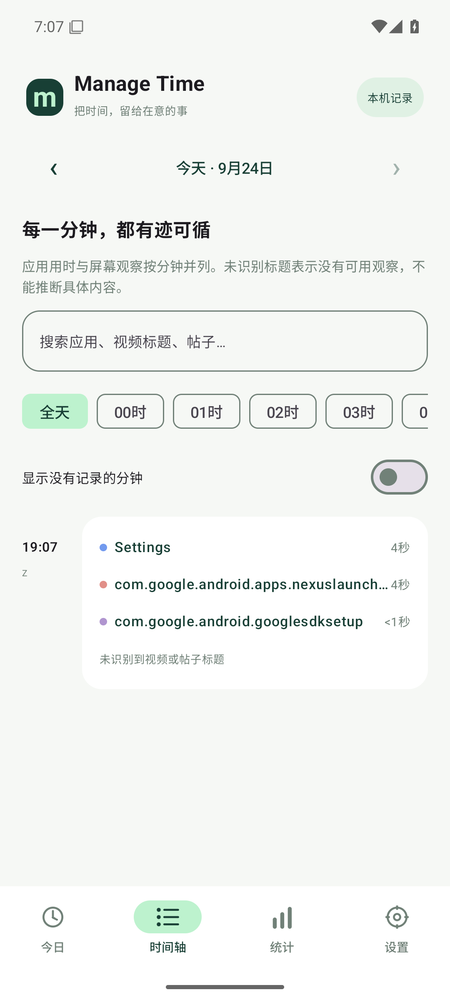
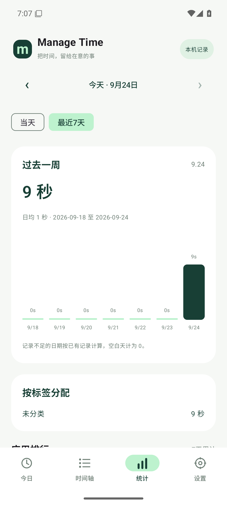
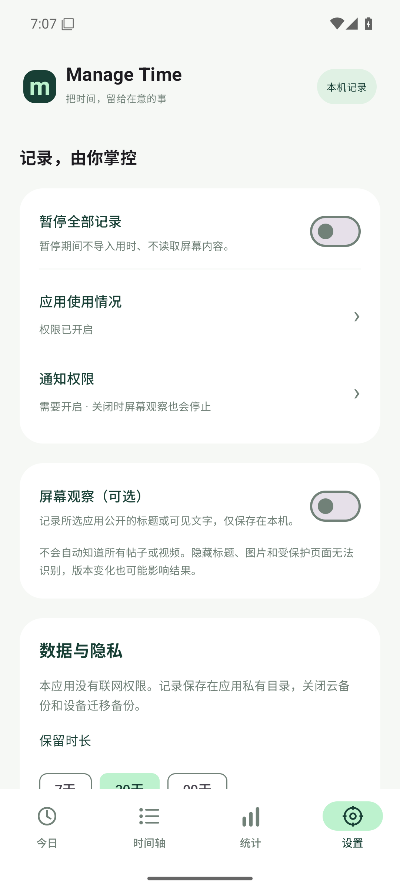

# Manage Time

[](https://github.com/WuHaoran-spec/Manage-Time/actions/workflows/android.yml)

**把时间，留给在意的事。**

一个开源、无广告、数据保存在本机的 Android 时间记录应用。使用 Kotlin 与 Jetpack Compose 构建，支持 **Android 8.0（API 26）及以上**。界面采用适合手机的每日概览、分钟时间轴、统计与设置，灵感来自桌面时间追踪工具。

> 当前为 **0.1.0 预览版**。应用用时与“屏幕上观察到的文字”分开记录。无法保证识别所有帖子或视频，也不把文字线索当成真实观看历史。

## 实际界面

Android 15 模拟器的实际运行截图。用时来自系统设置等测试操作，未注入演示数据库；这些截图不代表 B 站标题识别的真机效果。

<p>
  
  
  
  
</p>

## 功能

| 功能 | 实现方式 |
| --- | --- |
| 各应用使用时长 | 导入 Android `UsageStatsManager` 前台使用事件，重建会话 |
| 每日概览 | 总时长、应用排行、使用次数、最长连续使用、全天色带 |
| 分钟时间轴 | 同一分钟内各应用实际占用时长，支持日期、小时与文字搜索 |
| 视频 / 帖子线索 | 可选无障碍服务，每 15 秒最多采样一次所选应用公开的标题或可见文字 |
| B 站 | 尝试识别带标题标识或标题语义的可见节点；识别失败时不猜测 |
| 日 / 周统计 | 最近 7 天柱状图、日均、应用排行与自定义标签 |
| 使用预算 | 为每个应用设置每日分钟预算，通过通知提醒，不强制阻止应用 |
| 专注计时 | 15 / 25 / 45 分钟；离开后继续计时，返回查看剩余时间 |
| 数据管理 | CSV 导出、暂停全部记录、7 / 30 / 90 天保留期、删除历史 |

“使用次数”表示观察到的前台会话次数，**不是精确的应用启动次数**。系统可能把应用内 Activity 切换记录为新的会话。

## 安装

从本仓库 [Releases](https://github.com/WuHaoran-spec/Manage-Time/releases) 下载预览 APK，或者从成功的 [Android CI](https://github.com/WuHaoran-spec/Manage-Time/actions/workflows/android.yml) 工作流下载 `Manage-Time-debug`。这是调试签名的测试安装包；不同构建机器的签名可能不同，更新时可能需要先导出数据再卸载旧版。

1. 安装并打开 **Manage Time**。
2. 在引导卡片中打开系统的“使用情况访问”并授权。
3. 使用其他应用，再返回刷新，即可查看用时和分钟时间轴。
4. 如需记录视频 / 帖子线索：到“设置”阅读说明并同意“屏幕观察”，**手动选择应用**，开启通知和“内容记录状态”通知渠道，再到系统无障碍设置启用 Manage Time。
5. 打开已选择的应用，停留在有公开可读标题的页面；返回时间轴查看观察。首次采样或短暂浏览可能没有记录。

Android 13 及以上从外部安装的应用可能需要在系统应用详情菜单中允许“受限设置”后才能开启无障碍服务。不同厂商入口不同。没有无障碍权限，普通应用用时统计仍可工作。

## 哪些内容能知道，哪些不能

- **用时**：知道系统报告的前台应用及时间区间。锁屏 / 关屏结束当前会话；分屏、画中画使用单前台应用统计口径，不累计多个窗口时长。
- **屏幕观察**：只有用户选择的应用、屏幕解锁且存在可读节点时，才尝试保存标题线索。数据带原始采样时间和来源标记；不会把一次采样延伸为整分钟持续观看。
- **不能还原过去看过的内容**：开启前的帖子和视频详情无法补录。应用使用历史首次最多导入最近约 48 小时；系统可能只保留更少事件。
- **不能保证知道每一分钟具体看了什么**：短暂停留、标题隐藏、全屏视频、自绘界面、服务被系统停止都可能留下空白。显示“未识别”而不是编造内容。
- **不是录屏 / OCR / 录音工具**：不申请截屏、麦克风、摄像头或互联网访问权限。

## 隐私

屏幕观察默认关闭，应用选择默认空白，并且必须同意说明及系统授权。应用没有 `INTERNET` 权限，没有服务器、遥测、广告或账号登录。记录只进入应用私有 SQLite 数据库，系统备份和设备迁移备份禁用。

采集会跳过密码节点、输入框及带敏感标识的节点，并排除已知聊天、支付、密码管理和系统敏感应用。过滤是保守防护，无法穷尽第三方界面中的私人内容；请只选择自己愿意记录的应用。公开的帖子或视频标题本身也可能敏感。

常驻状态通知提供暂停入口。通知权限或记录状态渠道被关闭时，屏幕观察停止。暂停区间会保存下来，后续同步不会补录这段时间；删除记录会设置历史截止线，避免删除后重新导入。导出的 CSV 由你自行管理。

详见 [隐私说明](PRIVACY.md)。

## 构建

需要 JDK 17、Android SDK Platform 35 / Build Tools 35.0.0；Gradle Wrapper 自动下载 Gradle 8.11.1。

```bash
git clone https://github.com/WuHaoran-spec/Manage-Time.git
cd Manage-Time
# 配置 ANDROID_HOME 或本地 local.properties 的 sdk.dir
./gradlew :core:test :app:testDebugUnitTest :app:lintDebug :app:assembleDebug
```

Windows 使用 `gradlew.bat`。APK 输出在 `app/build/outputs/apk/debug/app-debug.apk`。`local.properties`、构建目录和签名文件均不提交仓库。

技术栈固定为 AGP 8.9.2、Kotlin 2.1.20、Compose BOM 2025.04.01、WorkManager 2.10.1；最低 API 26，目标 API 35。

## 项目结构

```text
app/src/main/java/com/managetime/app/
  MainActivity.kt           四个页面、权限引导、导出和专注计时
  UsageSyncWorker.kt        周期归档（约15分钟，受系统调度影响）
  data/                    SQLite、设置、系统使用事件导入、预算通知
  capture/                 可选的可见标题观察与过滤
core/                      无 Android 依赖的用时算法、CSV 工具和单元测试
.github/workflows/          构建、测试、Lint 和 APK 工件
scripts/                   指定模拟器上的页面切换与截图检查
docs/TESTING.md             测试与真机验收步骤
```

## 已知限制

- 系统使用事件不是绝对精确的秒表；多窗口、系统事件缺失和厂商实现会影响统计。
- 同步通常回看最近约 48 小时，并额外查询之前一天的边界事件；较长时间未运行时会从上次成功同步位置尝试恢复至保留期限。能否补全仍取决于系统是否保留这些事件。建议允许后台运行，定期打开应用。
- 无障碍观察按 15 秒间隔采样，帖子快速滚动时可能遗漏。候选标题可能来自推荐内容、页面标题或其他可见区域。
- 内容记录依赖第三方 UI 结构，B 站更新后可能需要调整适配。当前没有通过登录 API 获取播放历史。
- 每日预算通知按归档结果触发，一天同一应用最多提醒一次；不承诺准点阻断。专注计时当前无后台响铃。
- 时间按本机时区显示，CSV 使用 UTC 时间；更改系统时间或时区可能影响日期归属。
- 当前发布方式为 GitHub 侧载预览；未宣称已通过 Google Play 审核。无障碍 API 的应用商店分发需要另行满足平台政策。

## 参与开发

欢迎提交 Issue 和 Pull Request。涉及标题识别的反馈请提供应用版本及**已脱敏**的节点描述，避免上传私人浏览记录。新增采集功能必须保持显式同意、应用选择和本机存储。

参考 Android 官方文档：[UsageStatsManager](https://developer.android.com/reference/android/app/usage/UsageStatsManager)、[UsageEvents.Event](https://developer.android.com/reference/android/app/usage/UsageEvents.Event)、[AccessibilityService](https://developer.android.com/reference/android/accessibilityservice/AccessibilityService)。

## 许可

[MIT License](LICENSE)。
